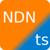

# NDNts Personal CA

**NDNts Personal CA** creates an NDN Certificate Authority for all your end hosts.
It is great for:

* A power user who has multiple end hosts.
* A webapp developer that wants to provide NDN certificates to website visitors.

## Instructions

System requirements:

* Node.js >=12.17, >=14.1
* Windows 10, Debian 10, or Ubuntu 18.04

Setup steps:

1. Clone the repository.
2. Copy `sample.env` to `.env`.
3. Run `npm start`.
4. Visit http://localhost:8722/ in a web browser.

To obtain an NDN testbed certificate and start issuing sub-certificates:

1. Open [NDNCERT-legacy](https://ndncert.named-data.net/), enter your email and select "guest certificate".
2. When prompted to run `ndnsec-keygen`, generate a key on Personal CA "manage CA keychain" page instead.
   Then, click "request cert" and copy-paste the certificate request into NDNCERT-legacy.
3. When you get email to install issued certificate, copy-paste the email into the "request cert" page.
4. Go to Personal CA "create new CA profile" page, and select the testbed certificate.

You can then obtain sub-certificates from this Personal CA using one of these methods:

* use a NDNCERT v0.3 client
* use "submit a certificate request" page

### Try on Glitch

You can try NDNts Personal CA on [Glitch](https://glitch.com), without local installation.

1. [Import the Project](https://glitch.com/#!/import/github/yoursunny/NDNts-CA/)
2. Select *Tools - Terminal*. In the terminal, execute `bash glitch-init.sh`.
3. Wait about 1 minute for dependency installation. You may watch the progress in *Tools - Logs*. `http://localhost:3000` indicates the application is ready.
4. Select *Show - in a new window* to open the application.

Note that Glitch is unsuitable for long-term installation, because anyone who knows your Glitch application name will be able to access your CA, and the NDNCERT server is available only if you are accessing the Glitch application from the web.

## Technical Information

NDNts Personal CA is built with:

* [NDNts](https://yoursunny.com/p/NDNts/), Named Data Networking libraries for the modern web.
* [Express](https://expressjs.com/) web framework.

This project shows how to write a Node.js application with NDNts libraries.
It also demonstrates these NDNts capabilities:

* Key generation and certificate management from `@ndn/keychain` package.
* NDNCERT v0.3 protocol implementation from `@ndn/ndncert` package.
* Embedded repo from `@ndn/repo` package.
